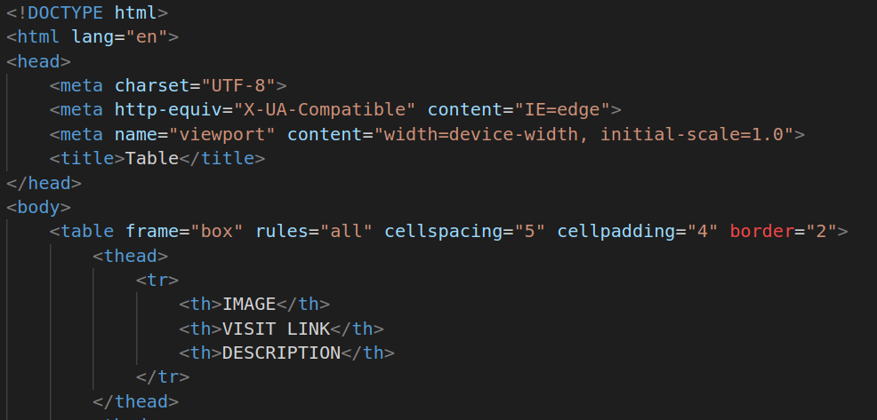
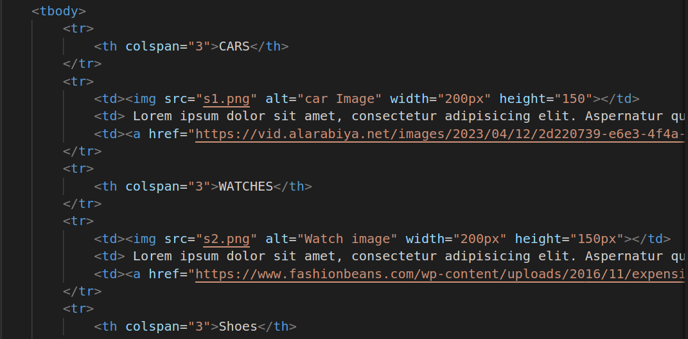

# Table Formation
1.
##### Explanation
* table tag is container for creating a table structure. It holds all the rows, cells, headers, and other table-related elements. It has various attributes to control table properties, such as border, cellspacing, cellpadding, etc.
* thead Stands for "table header." It groups the header content in a table. Typically, it contains one or moretable row elements that hold table header cell elements.
* tr Stands for "table row." It represents a row in the table. It contains one or more 
* th Stands for "table header." It represents a header cell in the table.
* border Specifies the width of the border around the table. It takes a numerical value. 
* cellspacing Specifies the space between adjacent cells. It takes a numerical value in pixels.
* cellpadding Specifies the space within each cell to create padding. It takes a numerical value in pixels.
* frame Specifies which sides of the table should be surrounded by a border
* rules Specifies whether to display inner and outer borders in the table. Values can include "none," "groups," "rows," "cols," or "all."

2.
##### Explanation
* tbody Stands for "table body." It groups the main content of the table. Like thead, it contains one or more tr elements that hold td table data cell elements.
* td Stands for "table row." It represents a row in the table.
* a is anchor tag and href is used for determining destination for source.